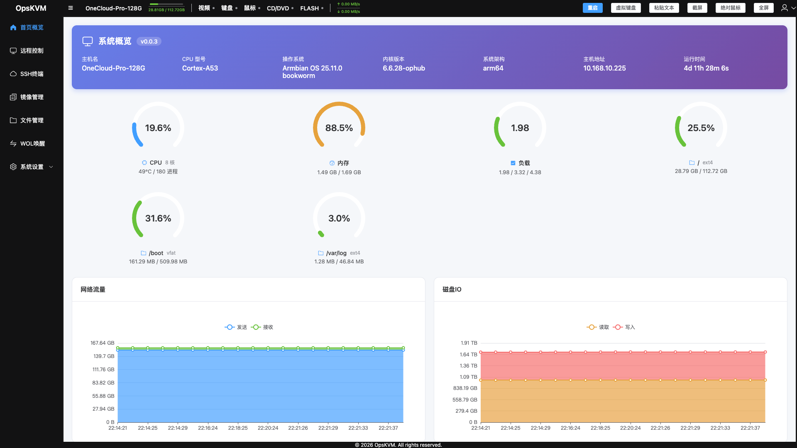
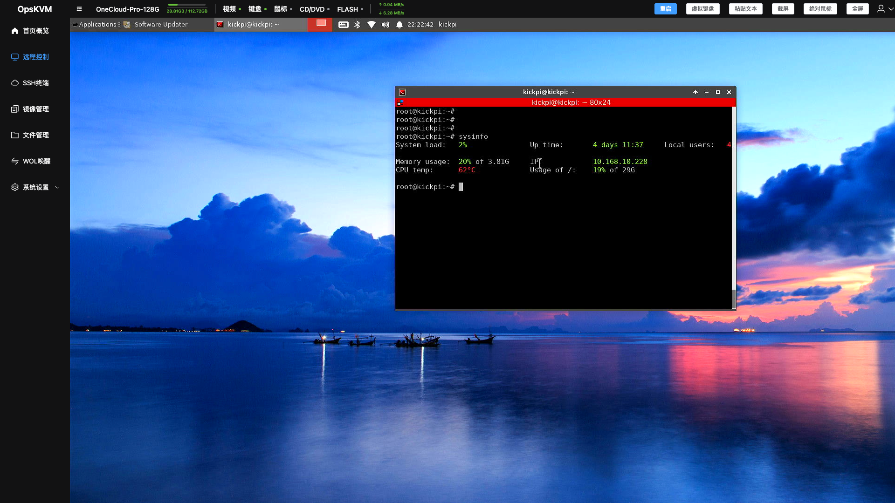
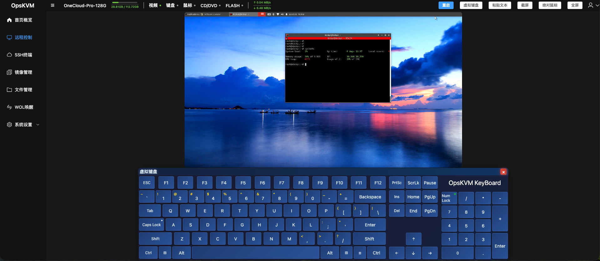
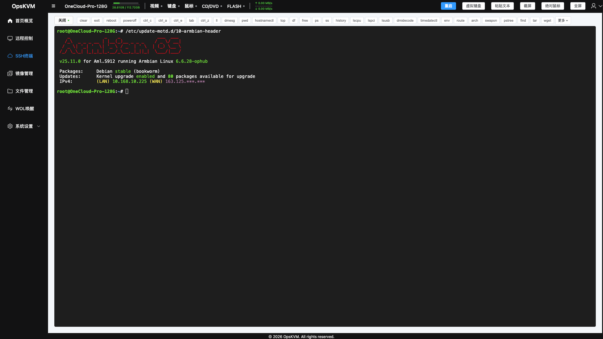
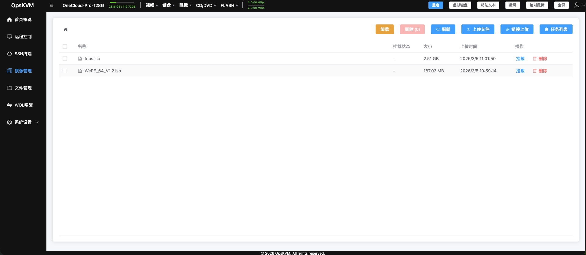
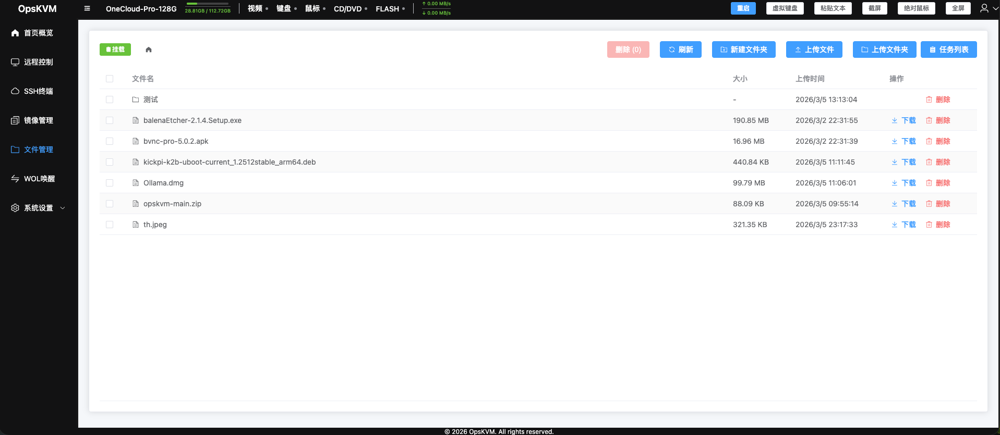
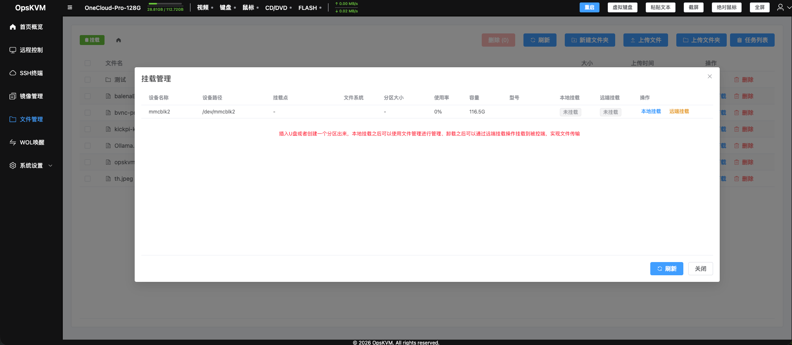
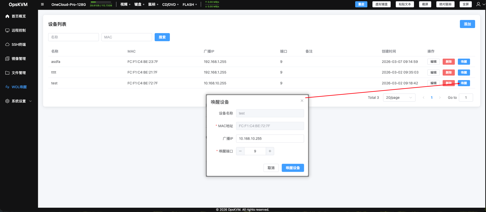
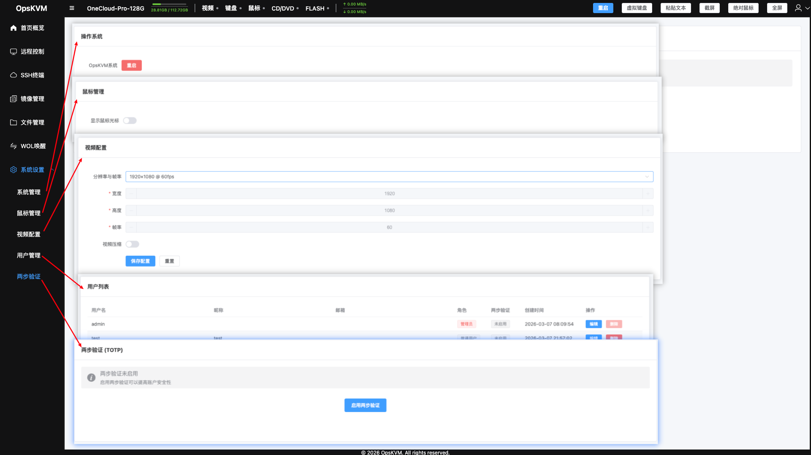

# OPSKVM

OPSKVM 是一个基于 Web 的 KVM (Keyboard-Video-Mouse) 远程管理系统，支持视频流传输、键盘鼠标控制、文件管理、远程唤醒等功能。


后端项目地址：https://github.com/hqiaozhi/opskvm
前端项目地址：https://github.com/hqiaozhi/opskvm-vue3

## 功能特性

### 内置前端
- 内嵌前端
- 一键启动

### KVM 控制
- 视频流传输：通过 WebSocket 实时获取摄像头视频流(MJPEG格式)   
- 键盘控制：支持通过 Web 远程发送键盘按键
- 鼠标控制：支持鼠标模式切换和坐标传输
- 配置管理：支持视频分辨率、帧率、压缩参数配置

### 用户管理
- 用户注册与登录
- 密码修改
- 用户信息管理（支持多用户）
- TOTP 双因素认证支持
- JWT token 认证

### 文件管理
- 文件浏览与列表
- 文件上传（支持分块上传，秒传）
- 文件下载
- 目录创建
- 设备挂载（otg模式：USB设备、硬盘、分区可挂载到被控端）

### 镜像管理
（需要otg模式才支持）
- 镜像iso、img格式管理
- 分片上传支持、秒传支持
- URL 远程下载
- 存储空间管理
- 挂载和卸载镜像

### 远程唤醒 (Wake-on-LAN)
- WoL 配置管理
- 远程唤醒设备
- MAC 地址管理

### WebShell 终端
- WebSocket SSH 终端
- 内置多个快捷命令按钮

### 系统功能
- 系统状态显示
- 网络速度监控
- 系统重启
- 支持热插拔

## 技术栈
- **后端框架**: GoFrame v2
- **数据库**: SQLite
- **Web 服务器**: GoFrame ghttp
- **WebSocket**: gorilla/websocket
- **视频捕获**: github.com/korandiz/v4l
- **串口通信**: go.bug.st/serial
- **系统信息**: github.com/shirou/gopsutil
- **JWT**: github.com/golang-jwt/jwt
- **TOTP**: github.com/pquerna/otp

## 构建说明

### 环境要求

- Go 1.25+
- Linux (仅支持 Linux，不支持 Windows)

### 构建命令

```bash
# 使用 Go 构建
make go

# 使用 GoFrame CLI 构建
make gf
```

构建产物位于 `bin/go`或`bin/gf` 目录下：
- `opskvm-linux-amd64-v0.0.3`
- `opskvm-linux-arm64-v0.0.3`

### 安装
默认账户：admin
默认密码：admin123
（支持安装时指定账户和密码，也可以安装之后通过系统用户管理修改）
```bash
# 安装到系统
./opskvm-linux-arm64-v0.0.3 install                                                                      <dev>
2026-03-10T22:11:55.441+08:00 [INFO] {e421f1c345809b18932bfa7599a6605e} stop old opskvm service...
2026-03-10T22:11:55.673+08:00 [INFO] {e421f1c345809b18932bfa7599a6605e} Copying executable to /usr/local/bin/opskvm...
2026-03-10T22:11:55.858+08:00 [INFO] {e421f1c345809b18932bfa7599a6605e} OTG device found or both devices exist, using --hidmode otg
2026-03-10T22:11:55.859+08:00 [INFO] {e421f1c345809b18932bfa7599a6605e} Systemd service file created at:  /lib/systemd/system/opskvm.service
2026-03-10T22:11:57.687+08:00 [INFO] {e421f1c345809b18932bfa7599a6605e} Systemd daemon reloaded
2026-03-10T22:11:59.184+08:00 [INFO] {e421f1c345809b18932bfa7599a6605e} opskvm service enabled
2026-03-10T22:11:59.293+08:00 [INFO] {e421f1c345809b18932bfa7599a6605e} opskvm service started successfully
● opskvm.service - opskvm service
     Loaded: loaded (/lib/systemd/system/opskvm.service; enabled; preset: enabled)
     Active: active (running) since Tue 2026-03-10 22:11:59 CST; 77ms ago
   Main PID: 1003192 (opskvm)
      Tasks: 7 (limit: 1743)
     Memory: 3.3M
        CPU: 68ms
     CGroup: /system.slice/opskvm.service
             └─1003192 /usr/local/bin/opskvm --hidmode otg

3月 10 22:11:59 OneCloud-Pro-128G systemd[1]: Started opskvm.service - opskvm service.
```

## 运行说明

### 快速启动

```bash
# 默认配置启动
./opskvm
```

### 命令行参数

```
USAGE 
     opskvm COMMAND [OPTION] 
 
 COMMAND 
     install      install to system (need root permission) 
     uninstall    uninstall from system (need root permission) 
 
 OPTION 
     -H, --host            server host (default: "0.0.0.0") 
     -P, --port            port of http server (default: "8080") 
     -u, --username        login username (default: "admin") 
     -p, --password        login password (default: "admin123") 
     -d, --debug           debug mode,default false (true/false) 
     -D, --rootpath        root path (save data) (default: "/data/opskvm/") 
     -/--enroll            defaut false (true/false) 
     -S, --ssl             defaut true (true/false) 
     -/--swagger           defaut false (true/false) 
     -/--cors              defaut false (true/false) 
     -s, --secretkey       jwt secret key (default: "hv4cW0kHLoigQcmVlHACmOIwVFaIQhd0qIf7SXgy4sffFRcmere85VKZrtbuMcH9") 
     -i, --issuer          jwt issuer (default: "opskvm") 
     -a, --audience        jwt audience (default: "opskvm") 
     -e, --expire          jwt expire hours (default: "2") 
     -r, --refresh         jwt refresh hours (default: "12") 
     -m, --signingmethod   jwt signing method (default: "HS256") 
     -/--hidmode           hid mode otg/ch9329 (default: "otg") 
     -/--udcname           udc name (default: "opskvm") 
     -/--ch9329path        ch9329 path, empty for auto detect 
     -/--videopath         video path, empty for auto detect 
     -/--videowidth        video width (default: "1920") 
     -/--videoheight       video height (default: "1080") 
     -/--videofps          video fps (default: "30") 
     -l, --list            find video device 
     -/--loglevel          set log level (default: "info") 
     -v, --version         show version information of current binary 
     -h, --help            more information about this command
```

### 服务模式

```bash
# 安装为系统服务
opskvm install

# 卸载系统服务
opskvm uninstall
```

## 目录结构

```
opskvm/
├── api/                  # API 接口定义
│   ├── files/            # 文件管理 API
│   ├── kvm/              # KVM 控制 API
│   ├── mirrors/          # 镜像管理 API
│   ├── system/           # 系统 API
│   ├── totp/             # TOTP API
│   ├── users/            # 用户管理 API
│   ├── wake/             # WoL API
│   └── webshell/         # WebShell API
├── bin/                  # 编译产物（编译后生成）
├── hack/                 # 构建配置
├── internal/             # 内部实现
│   ├── cmd/              # 命令行入口
│   ├── config/           # 配置管理
│   ├── controller/       # 控制器
│   ├── dao/              # 数据访问层
│   ├── logic/            # 业务逻辑
│   ├── model/            # 数据模型
│   └── service/          # 服务层
│       ├── files/        # 文件服务
│       ├── hid/          # HID 服务
│       ├── mirrors/      # 镜像服务
│       ├── sqlite/       # 数据库服务
│       ├── video/        # 视频服务
│       └── wol/          # WoL 服务
├── manifest/             # 部署清单
│   └── docker/           # Docker 配置
└── resource/             # 静态资源
```

## API 路由

| 路径 | 方法 | 说明 |
|------|------|------|
| /api/v1/kvm | GET | KVM 视频流 (WebSocket) |
| /api/v1/kvm/session | POST | 创建 KVM 会话 |
| /api/v1/kvm/on | POST | 开启摄像头 |
| /api/v1/kvm/off | POST | 关闭摄像头 |
| /api/v1/kvm/config | GET/PUT | KVM 配置 |
| /api/v1/users/login | POST | 用户登录 |
| /api/v1/users/register | POST | 用户注册 |
| /api/v1/users | GET/DELETE | 用户管理 |
| /api/v1/files | GET | 文件列表 |
| /api/v1/files | POST | 文件上传 |
| /api/v1/files/devices | GET | 外接设备列表 |
| /api/v1/files/mount | POST | 设备挂载 |
| /api/v1/mirrors | GET | 镜像列表 |
| /api/v1/mirrors | POST | 镜像上传 |
| /api/v1/wol | GET | WoL 列表 |
| /api/v1/wol | POST | 创建 WoL 配置 |
| /api/v1/wol/wake | POST | 唤醒设备 |
| /api/v1/shell | GET | WebShell (WebSocket) |
| /api/v1/system/info | GET | 系统信息 |
| /api/v1/system/restart | POST | 系统重启 |
| /api/v1/totp/setup | POST | TOTP 设置 |
| /api/v1/totp/verify | POST | TOTP 验证 |
......

## 界面预览
          


## 注意事项
- 本项目依赖 `github.com/korandiz/v4l` 库，仅支持 Linux 系统
- 需要 root 权限运行以访问视频设备和 HID 设备
- 默认 HTTPS 已启用，使用自签名证书，可通过配置禁用
- 不支持找回密码，可以删除/data/opskvm/db.sqlite3后重启程序会恢复默认账号
- 其它问题欢迎提issue

## 许可证

MIT License
